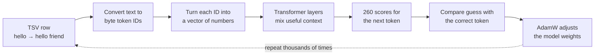

# Vanus AI Python comparison

This is a compact PyTorch version of the educational Vanus prompt/reply model.
It reads the same two-column TSV files as the Java version:

```text
prompt<TAB>response
```

It intentionally contains only the language-model path: byte tokenization,
causal transformer training, checkpoints, one-shot replies, and interactive
console chat. It has no Swing UI, HTTP server, SQLite store, or self-talk loop.

## Architecture, explained from the beginning

### The entire job in one picture

The program learns one simple job:

> Given the prompt bytes seen so far, predict the next byte of the response.

It repeats that next-byte prediction until it predicts the special `EOS`
token, which means "the response is finished."



During chat, the right side changes slightly. There is no known correct answer,
so there is no loss calculation and no weight update. The model chooses one
token, appends it to the sequence, and runs again to choose the next token.

### 1. The TSV file is the lesson book

Each nonempty line must contain exactly two text fields separated by one real
tab character:

```text
hello<TAB>hello friend. it is good to see you
good night<TAB>good night sleep well
```

The left side is the **prompt**. The right side is the **response the model
should learn to produce**. The TSV is not a database that the model searches at
chat time. During training, the examples change the model's numerical weights.
The checkpoint later stores those weights.

`load_pairs()` reads and validates this file. A malformed line is rejected
instead of being silently misunderstood.

### 2. Text becomes byte tokens

A neural network only accepts numbers. `encode()` converts a Python string to
UTF-8 and uses each byte value as one token ID:

```text
"hello" → [104, 101, 108, 108, 111]
```

English ASCII letters use one byte each. Some characters use several UTF-8
bytes. For example, a curly quote or emoji takes multiple tokens. This means
the model can represent any UTF-8 text without needing a word dictionary, but
long non-ASCII text consumes the context more quickly.

There are 260 possible token IDs:

| IDs | Meaning |
|---:|---|
| `0..255` | Real UTF-8 byte values |
| `256` | `BOS`: beginning of the complete sequence |
| `257` | `EOS`: end of the response |
| `258` | `USER`: the following bytes belong to the user's prompt |
| `259` | `ASSISTANT`: the model should begin its response here |

For the prompt `hello`, `prompt_tokens()` creates:

```text
[BOS, USER, 104, 101, 108, 108, 111, ASSISTANT]
```

For a training row `hello<TAB>hi`, the complete sequence is:

```text
[BOS, USER, h, e, l, l, o, ASSISTANT, h, i, EOS]
```

The letters in that diagram stand for their numeric UTF-8 byte IDs. They are
shown as letters only to make the sequence readable.

### 3. Training shifts the sequence by one position

The model is always asked to predict the next token. `training_example()` makes
an input list and a target list by shifting the sequence:

```text
Input:  [BOS, USER, h, e, l, l, o, ASSISTANT, h, i]
Target: [USER, h,    e, l, l, o, ASSISTANT, h, i, EOS]
```

At every horizontal position, the target is the token immediately to the right
of the input token. For example:

- After `ASSISTANT`, the desired next token is response byte `h`.
- After response byte `h`, the desired next token is response byte `i`.
- After response byte `i`, the desired next token is `EOS`.

This is called **causal next-token prediction** or **teacher forcing**. During
training, the correct earlier response tokens are supplied while the model
learns to predict the following token.

### 4. Prompt targets are ignored

This model is supervised specifically to answer prompts. It does not need to
spend its small capacity learning to reproduce the user's prompt. Therefore,
the target entries before the response are replaced with `IGNORE`, whose value
is `-100`:

```text
Input:  [BOS,    USER,   h,      e,      l,      l,      o,      ASSISTANT, h, i]
Target: [IGNORE, IGNORE, IGNORE, IGNORE, IGNORE, IGNORE, IGNORE, h,         i, EOS]
```

PyTorch's cross-entropy function skips `-100` targets. The transformer still
reads all prompt tokens as context, but mistakes in the prompt portion do not
contribute to the loss. Only response bytes and `EOS` teach the model.

### 5. A batch groups several lessons together

`make_batch()` randomly selects several TSV rows. `--batch-size 4` means one
training step uses four rows before updating the weights.

Rows have different lengths, but a tensor must be rectangular. Short rows are
padded to the length of the longest row in that batch. A padding mask tells
attention that the added positions are empty, and their targets are `IGNORE`,
so padding cannot teach false text.

A larger batch gives a smoother average training signal but uses more memory.
It does not mean four separate models are trained.

### 6. Token embeddings turn IDs into useful number vectors

Token ID `104` is only a label for byte `h`; the number 104 does not describe
what `h` means. `token_embedding` looks up a learned vector for each token.

With the `1m` preset, each token becomes a vector containing 160 floating-point
numbers:

```text
token 104 → [0.012, -0.031, 0.008, ... 157 more values]
```

At first these values are small random numbers. Training adjusts them. Tokens
that are useful in similar situations can develop useful patterns in their
vectors. No programmer labels a dimension as "greeting" or "noun." Meaning is
distributed across many numbers and is learned only from prediction errors.

### 7. Position embeddings tell the model where tokens occur

Attention sees a collection of vectors. Without position information, it would
not naturally know whether a token came first or last. `position_embedding`
contains another learned vector for position 0, position 1, and so on.

The model adds the two vectors:

```text
vector entering transformer = token vector + position vector
```

Consequently, the same byte can be represented differently at different
positions. This Python implementation uses learned absolute positions. Its
maximum position is the preset's `context` size.

### 8. The causal mask prevents cheating

While predicting a token, the model must not look at tokens to its right. If it
could see the correct future response during training, it could copy the answer
without learning how to generate it.

The causal attention mask has this shape, where `✓` means visible and `X` means
hidden:

```text
              token being read
              1  2  3  4
prediction 1  ✓  X  X  X
prediction 2  ✓  ✓  X  X
prediction 3  ✓  ✓  ✓  X
prediction 4  ✓  ✓  ✓  ✓
```

Position 3 can use positions 1, 2, and 3. It cannot inspect position 4. This
makes training behave like generation, where future text does not exist yet.

### 9. Self-attention decides which earlier tokens matter

Each transformer layer contains multi-head self-attention. For every position,
attention creates three learned views of its vector:

- **Query:** what information is this position looking for?
- **Key:** what kind of information does an earlier position contain?
- **Value:** what information should be copied if that position is useful?

Query and key vectors produce attention scores. After normalization, those
scores become weights. The layer makes a weighted mixture of the value vectors.

For example, while producing a reply to `cat is calm`, some attention may focus
on `cat`, some on `calm`, and some on the `ASSISTANT` boundary. These behaviors
are learned; the source code does not contain rules for cats, grammar, or
greetings.

There are multiple attention **heads**. Each head has its own projections, so
heads can learn different relationships. Eight heads do not guarantee eight
human-readable rules. They are simply eight parallel ways to combine context.

### 10. The feed-forward network transforms each position

After attention shares information between positions, a small feed-forward
network processes each position. In this implementation it:

1. Expands the vector from `width` to `hidden` values.
2. Applies the GELU nonlinear activation.
3. Projects the vector back to `width` values.

Attention moves and combines information. The feed-forward network transforms
that information. Stacking several layers repeats both operations, allowing
later layers to build on patterns found by earlier layers.

### 11. Normalization and residual paths keep learning stable

Each PyTorch transformer layer uses LayerNorm before its attention and
feed-forward work (`norm_first=True`). Residual connections add the original
vector back after each section:

```text
new vector = old vector + learned change
```

The model therefore learns modifications instead of rebuilding every vector
from nothing at every layer. A final LayerNorm is applied after the last
transformer layer. Dropout is zero because this is a small, controlled teaching
model.

### 12. Output scores choose among 260 tokens

The final linear projection changes each hidden vector into 260 numbers called
**logits**, one score per possible next token:

```text
score for byte 0
score for byte 1
...
score for byte 255
score for BOS
score for EOS
score for USER
score for ASSISTANT
```

Larger logits mean the model considers that token more likely. Softmax can turn
the logits into probabilities that sum to 1.

The output projection shares its weight matrix with the input token embedding.
This is called **weight tying**. The same learned token representation helps
both read a token and score it as the next output. Weight tying reduces the
number of parameters and often helps small language models.

### 13. Loss measures how wrong the model was

Cross-entropy compares the model's token probabilities with the correct target.
A confident correct prediction produces low loss. A confident wrong prediction
produces high loss. The program averages this over non-ignored response
positions and over the batch.

With 260 equally likely tokens, a completely untrained model should begin near:

```text
ln(260) ≈ 5.56 loss
```

Loss should generally trend downward, but individual batches differ, so it can
bounce up and down. A low training loss means the model predicts training
responses well. It does not automatically mean it will answer new prompts well.

### 14. Backpropagation finds how each weight affected the error

`loss.backward()` asks PyTorch autograd to follow the calculation backward.
For every trainable number, PyTorch calculates a gradient: a small signal
indicating how changing that number would change the loss.

This model has thousands or hundreds of thousands of such numbers. They include
embeddings, query/key/value projections, attention output projections,
feed-forward matrices, biases, and normalization values. Training does not add
new grammar code. It repeatedly changes these numbers.

Gradient clipping limits the combined gradient norm to 1.0. This prevents one
unusual batch from causing an enormous update that destabilizes the model.

### 15. AdamW updates the weights

AdamW uses the gradients plus moving averages of recent gradients to decide the
weight update. The learning rate controls the update size.

The first ten steps warm up gradually. After warmup, a cosine schedule slowly
reduces the learning rate. Early training can make larger discoveries; later
training makes smaller adjustments.

One **step** is:

```text
select a batch
→ predict response tokens
→ calculate loss
→ calculate gradients
→ clip gradients
→ AdamW updates weights
```

`2,000` steps repeats that process 2,000 times. It does not mean every TSV row
is read exactly 2,000 times because rows are selected randomly.

### 16. Prompt noise teaches small variations

By default, 15% of sampled prompts receive one small change, such as:

- Removing ending punctuation.
- Removing a comma.
- Removing an internal letter.
- Swapping two adjacent letters.

The response stays unchanged. This teaches examples such as:

```text
how are you doing? → I am doing well
how are you doin?  → I am doing well
```

It can improve tolerance for nearby typos, but it cannot teach every possible
misspelling. Too much prompt noise would make the lessons inconsistent.

### 17. The checkpoint stores learned state

After training, `torch.save()` writes a `.pt` checkpoint containing:

- Model configuration: width, hidden size, layers, heads, and context.
- Every learned model weight.
- AdamW optimizer state.
- The number of requested training steps.
- A format version for compatibility checks.

The TSV text itself is not copied into the checkpoint. The effect of training
is encoded approximately in the weights. Python checkpoints and Java `.vanus`
checkpoints are different formats and cannot be exchanged.

### 18. Chat is repeated next-token prediction

For `hello`, generation begins with:

```text
[BOS, USER, h, e, l, l, o, ASSISTANT]
```

Then `generate()` performs this loop:

1. Run the entire current sequence through the model.
2. Read the logits at the final position.
3. Choose one next token.
4. Stop if that token is `EOS`.
5. Otherwise append it and repeat.

Conceptually:

```text
hello → h
hello + h → e
hello + he → l
hello + hel → l
hello + hell → o
...
```

With temperature `0`, the program always chooses the highest-scoring token.
This is greedy generation and is repeatable. A temperature such as `0.7`
converts scores into a sampling distribution, producing more variety and also
more mistakes. Greedy output is usually better for this small controlled
dataset.

The console calls the model independently for every prompt. Previous chat
turns are not placed into the next prompt, so this version has no conversation
memory.

### 19. What the preset numbers mean

| Preset | Width | Hidden | Layers | Heads | Context | Actual parameters |
|---|---:|---:|---:|---:|---:|---:|
| `tiny` | 32 | 64 | 1 | 4 | 128 | 21,024 |
| `200k` | 96 | 176 | 2 | 4 | 128 | 180,832 |
| `1m` | 160 | 320 | 4 | 8 | 256 | 909,120 |

- **Width** is the number of values in each token vector.
- **Hidden** is the expanded size inside each feed-forward network.
- **Layers** is how many attention-plus-feed-forward blocks are stacked.
- **Heads** is how many parallel attention views each layer uses.
- **Context** is the maximum number of input positions, measured in byte tokens.
- **Parameters** are learned floating-point numbers, not stored phrases.

The preset names are convenient size labels. PyTorch's standard transformer
contains biases and learned position embeddings that differ from the Java
architecture, so its exact parameter counts differ from the Java presets.

### 20. What this small model can and cannot do

It can learn repeated patterns in a narrow, consistent dataset. It can memorize
common prompt/response mappings, combine some familiar byte patterns, and gain
limited tolerance for variations represented during training.

It will struggle with broad conversation, facts absent from the dataset, long
reasoning, rare wording, and prompts far from its examples. More steps cannot
create information the dataset never supplies. More parameters can store more
patterns, but they also need enough varied data and training to learn those
patterns. A low training loss with poor new prompts usually indicates
memorization or insufficient variety.

This model is useful as a visible experiment in tokenization, attention,
training, and generation. It is far smaller and less broadly trained than a
production LLM.

### 21. Where each part lives in the code

| Code | Responsibility |
|---|---|
| `ModelConfig` and `PRESETS` | Model sizes and context limits |
| `encode()`, `decode()`, `prompt_tokens()` | Byte tokenizer and control tokens |
| `load_pairs()` | TSV parsing and validation |
| `TinyTransformer` | Embeddings, attention layers, normalization, and output scores |
| `training_example()` | Shifted inputs, targets, and prompt-loss masking |
| `corrupt_prompt()` | Training-time typo and punctuation variations |
| `make_batch()` | Random row selection, padding, and tensor creation |
| `train()` | Loss, backpropagation, AdamW, logging, and checkpoint saving |
| `generate()` | Autoregressive next-token generation |
| `chat()` | Interactive terminal loop |
| `parser()` | `train`, `chat`, and `reply` command-line options |

## Setup

From the repository root:

```sh
cd python
python3 -m venv .venv
source .venv/bin/activate
python3 -m pip install --upgrade pip
python3 -m pip install -r requirements.txt
```

## Train on Scatty

Quick learning run:

```sh
python3 vanus.py train \
  --data ../core/vanus-ai-java/data/scatty-language/scatty.tsv \
  --checkpoint checkpoints/scatty-1m.pt \
  --size 1m \
  --steps 2000 \
  --batch-size 4
```

Longer run:

```sh
python3 vanus.py train \
  --data ../core/vanus-ai-java/data/scatty-language/scatty.tsv \
  --checkpoint checkpoints/scatty-1m.pt \
  --size 1m \
  --steps 10000 \
  --batch-size 4
```

The default 15% prompt noise introduces a small punctuation deletion, letter
deletion, or adjacent-letter swap so inputs such as `hellow` have a chance to
work. Set `--prompt-noise 0` to disable it. Device selection is automatic:
CUDA, then Apple MPS, then CPU. Use `--device cpu` to force CPU training.

## Console chat

```sh
python3 vanus.py chat --checkpoint checkpoints/scatty-1m.pt
```

Example:

```text
You: hello
VanusPy: hello friend. it is good to see you
You: good night
VanusPy: good night sleep well
You: /quit
```

Generate one reply without entering interactive mode:

```sh
python3 vanus.py reply --checkpoint checkpoints/scatty-1m.pt "hello"
```

Generation is greedy by default, which is usually best for this small dataset.
For variation, add `--temperature 0.7`.

## Comparison with the Java model

Both versions use UTF-8 bytes `0..255` plus BOS, EOS, USER, and ASSISTANT
tokens. Both train causally and exclude prompt tokens from the supervised loss,
so the model learns to generate the response after the prompt. Both use AdamW,
gradient clipping, fixed random seeds, and optional typo augmentation.

The Python code delegates tensors, automatic differentiation, attention, and
optimization to PyTorch. The Java project implements those mechanisms itself
for education. PyTorch's standard transformer uses learned position embeddings,
LayerNorm, GELU, and biased projection layers, while the Java transformer uses
its hand-built architecture. Preset names therefore describe similar scale and
context, not byte-for-byte identical networks or interchangeable checkpoints.
